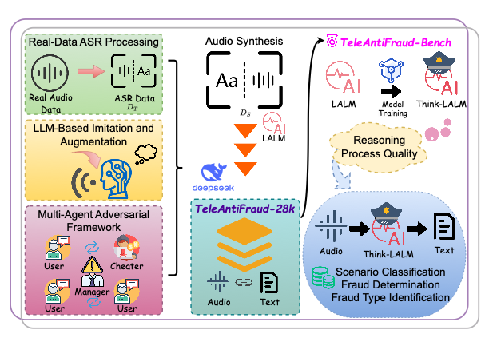
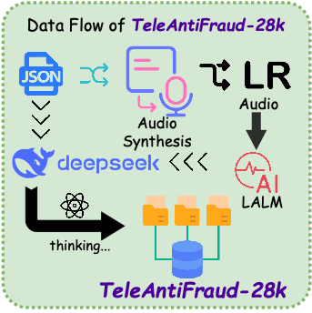
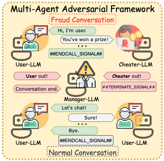
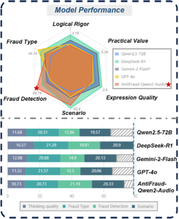

# TeleAntiFraud-28k 📞🛡️

<p align="center">
  <a href="https://huggingface.co/datasets/JimmyMa99/TeleAntiFraud">
    
  </a>
  <a href="https://www.modelscope.cn/datasets/JimmyMa99/TeleAntiFraud-28k">
    
  </a>
</p>

<p align="center">
  <a href="https://huggingface.co/JimmyMa99/AntiFraud-SFT">
    
  </a>
  <a href="https://www.modelscope.cn/models/JimmyMa99/AntiFraud-SFT">
    
  </a>
</p>

<p align="center">
  <a href="https://arxiv.org/abs/2503.24115">
    
  </a>
  <a href="https://arxiv.org/abs/2601.01392">
    
  </a>
</p>

## 🎉 News

- **[2026.04]** We launched the **TeleAntiFraud open-source community** for telecom anti-fraud research: https://teleantifraud.github.io/ 🌐
- **[2026.04]** [**SAFE-QAQ: End-to-End Slow-Thinking Audio-Text Fraud Detection via Reinforcement Learning**](https://arxiv.org/abs/2601.01392) has been accepted by ACL 2026! 🎊
- **[2025]** **TeleAntiFraud-28k: An Audio-Text Slow-Thinking Dataset for Telecom Fraud Detection** has been accepted by ACM MM 2025! 🎊
- **[2026.04]** A sanitized public release with dataset card, audio archives, and preview samples is now available on [Hugging Face](https://huggingface.co/datasets/JimmyMa99/TeleAntiFraud) and [ModelScope](https://www.modelscope.cn/datasets/JimmyMa99/TeleAntiFraud). 📚
- **[Dataset]** TeleAntiFraud-28k is available on [ModelScope](https://www.modelscope.cn/datasets/JimmyMa99/TeleAntiFraud-28k). 📚

TeleAntiFraud-28k is the first open-source audio-text slow-thinking dataset specifically designed for automated telecom fraud analysis. This dataset integrates audio signals with reasoning-oriented textual analysis, providing high-quality multimodal training data for telecom fraud detection research. 🔍💡



## 📊 Dataset Overview

- **Total Samples**: 28,511 rigorously processed speech-text pairs 📋
- **Total Audio Duration**: 307 hours ⏱️
- **Unique Feature**: Detailed annotations for fraud reasoning 🧠
- **Task Categories**: Scenario classification, fraud detection, fraud type classification 🎯

### Public Dataset Release

We provide a sanitized public release for direct download and benchmarking:

- [Hugging Face dataset page](https://huggingface.co/datasets/JimmyMa99/TeleAntiFraud)
- [ModelScope dataset page](https://www.modelscope.cn/datasets/JimmyMa99/TeleAntiFraud)
- packaged `binary_classification.zip`, `sft.zip`, and `audio.zip`
- preview audio samples directly playable on the dataset page
- normalized relative audio paths without machine-specific absolute paths


## 🏗️ Dataset Construction Strategies




### 1. 🔒 Privacy-preserved Text-Truth Sample Generation
- Using ASR-transcribed call recordings (with anonymized original audio)
- Ensuring real-world consistency through TTS model regeneration
- Strict adherence to privacy protection standards
### 2. 🚀 Semantic Enhancement
- LLM-based self-instruction sampling on authentic ASR outputs
- Expanding scenario coverage to improve model generalization
- Enriching the diversity of conversational contexts

### 3. 🤖 Multi-agent Adversarial Synthesis



- Simulation of emerging fraud tactics
- Generation through predefined communication scenarios and fraud typologies
- Enhancing dataset adaptability to new fraud techniques

## 🎯 TeleAntiFraud-Bench



We have constructed TeleAntiFraud-Bench, a standardized evaluation benchmark comprising proportionally sampled instances from TeleAntiFraud-28k, to facilitate systematic testing of model performance and reasoning capabilities on telecom fraud detection tasks. 📐✅

### Evaluation Utilities

We provide sanitized evaluation scripts in [`evaluation/`](evaluation/README.md), including:

- classification metrics for scenario classification, fraud detection, and fraud type classification
- preparation of model outputs for reasoning assessment
- an OpenAI-compatible LM-as-judge runner
- the probability-based reasoning-quality judging prompt

The ACL 2026 paper repository SAFE-QAQ, which reports results on TeleAntiFraud, is available at [Control-derek/SAFE-QAQ](https://github.com/Control-derek/SAFE-QAQ).

## 🤖 Model Contribution

We contribute a production-optimized supervised fine-tuning (SFT) model based on Qwen2-Audio, trained on the TeleAntiFraud training set. 🎨⚡

### Released Model

- [Hugging Face model: JimmyMa99/AntiFraud-SFT](https://huggingface.co/JimmyMa99/AntiFraud-SFT)
- [ModelScope model: JimmyMa99/AntiFraud-SFT](https://www.modelscope.cn/models/JimmyMa99/AntiFraud-SFT)
- base model: `Qwen/Qwen2-Audio-7B-Instruct`
- model type: supervised fine-tuning for audio-text telecom fraud detection

## 📝 Examples

Explore our dataset examples to better understand the telecom fraud detection capabilities: 👀

- [Case 1: Normal Conversation Analysis](example/case1think.html) - Detailed analysis of a legitimate phone conversation ✅
- [Case 2: Fraud Conversation Analysis](example/case2think.html) - Step-by-step reasoning for detecting a fraudulent call ⚠️
- [Evaluation Sample](example/eval_sample.html) - Representative sample from our evaluation benchmark 📊
- [Model Output: Normal Conversation](example/result1think.html) - Our model's reasoning process on a legitimate call 🤖✅
- [Model Output: Fraud Detection](example/result2think.html) - Model's analysis and detection of a fraudulent call 🤖⚠️

## 🛠️ Multi-Agent Data Collection

To collect fraudulent conversation data: 💼
1. Insert your API key in `multi-agents-tools/AntiFraudMatrix/main.py` (uses SiliconFlow API key) 🔑
2. Run the following command to generate fraudulent dialog text:
   ```bash
   python multi-agents-tools/AntiFraudMatrix/main.py
   ```
3. Results will be saved in the `result` directory 📁

For normal conversation data: 💬
- Use `multi-agents-tools/AntiFraudMatrix-normal/main.py` following the same process

## 🎙️ Voice Synthesis with ChatTTS

To synthesize speech from the collected text: 🔊
1. Install the necessary dependencies 📦
2. Run the API server:
   ```bash
   fastapi dev ChatTTS/examples/api/main_new_new.py --host 0.0.0.0 --port 8006
   ```
3. Use any of the scripts in `ChatTTS/examples/api/normal_run*.sh` or `ChatTTS/examples/api/run*.sh` 🚀

   Modify the port in these scripts if needed, then run:
   ```bash
   bash ChatTTS/examples/api/run*.sh
   ```

## 🌟 Open-Source Resources

- [TeleAntiFraud public dataset release (Hugging Face)](https://huggingface.co/datasets/JimmyMa99/TeleAntiFraud) 🤗
- [TeleAntiFraud public dataset release (ModelScope)](https://www.modelscope.cn/datasets/JimmyMa99/TeleAntiFraud) 📚
- [AntiFraud-SFT model (Hugging Face)](https://huggingface.co/JimmyMa99/AntiFraud-SFT) 🤖
- [AntiFraud-SFT model (ModelScope)](https://www.modelscope.cn/models/JimmyMa99/AntiFraud-SFT) 🤖
- [SAFE-QAQ code repository](https://github.com/Control-derek/SAFE-QAQ) 🧪
- [TeleAntiFraud-28k dataset](https://www.modelscope.cn/datasets/JimmyMa99/TeleAntiFraud-28k) 📚
- TeleAntiFraud-Bench evaluation benchmark 🏆
- [Evaluation and LM-as-judge utilities](evaluation/README.md) ⚖️
- Data processing framework (supporting community-driven dataset expansion) 🔧
- TeleAntiFraud-Qwen2-Audio SFT model 🤖

## 🎯 Key Contributions

1. Establishing a foundational framework for multimodal anti-fraud research 🏗️
2. Addressing critical challenges in data privacy and scenario diversity 🔐
3. Providing high-quality training data for telecom fraud detection 📈
4. Open-sourcing data processing tools to enable community collaboration 🤝

## 🙏 Acknowledgements

We would like to express our sincere gratitude to all the organizations and individuals who have provided invaluable support throughout this project: ❤️

- [**China Mobile Internet Company (中移互联网)**](https://cmic.chinamobile.com/pages/pcIndex) - For their industry expertise and technical guidance 🏢
- [**Intern Community (书生社区)**](https://github.com/InternLM) - For their open-source ecosystem support and collaboration 🌍
- [**ModelScope Community (魔搭社区)**](https://github.com/modelscope) - For their platform support and community resources 🎪
- [**SmartFlowAI Community (机智流社区)**](https://github.com/SmartFlowAI) - For their technical contributions and collaborative efforts 💡
- [**Control-derek**](https://github.com/Control-derek) - For his technical expertise and valuable contributions 👨‍💻
- [**vansin**](https://github.com/vansin) - For his dedicated support and assistance 🤝
- [**Jintao-Huang**](https://github.com/Jintao-Huang) - For his valuable suggestions and contributions 💭

Their contributions have been instrumental in making this project a success and advancing the field of telecom fraud detection research. 🚀

## 📄 Citation

``` 
@inproceedings{ma2025teleantifraud,
  title={TeleAntiFraud-28k: An Audio-Text Slow-Thinking Dataset for Telecom Fraud Detection},
  author={Ma, Zhiming and Wang, Peidong and Huang, Minhua and Wang, Jinpeng and Wu, Kai and Lv, Xiangzhao and Pang, Yachun and Yang, Yin and Tang, Wenjie and Kang, Yuchen},
  booktitle={Proceedings of the 33rd ACM International Conference on Multimedia},
  pages={5853--5862},
  year={2025}
}

@article{wang2026safe,
  title={SAFE-QAQ: End-to-End Slow-Thinking Audio-Text Fraud Detection via Reinforcement Learning},
  author={Wang, Peidong and Ma, Zhiming and Dai, Xin and Liu, Yongkang and Feng, Shi and Yang, Xiaocui and Hu, Wenxing and Wang, Zhihao and Pan, Mingjun and Yuan, Li and others},
  journal={arXiv preprint arXiv:2601.01392},
  year={2026}
}
```
